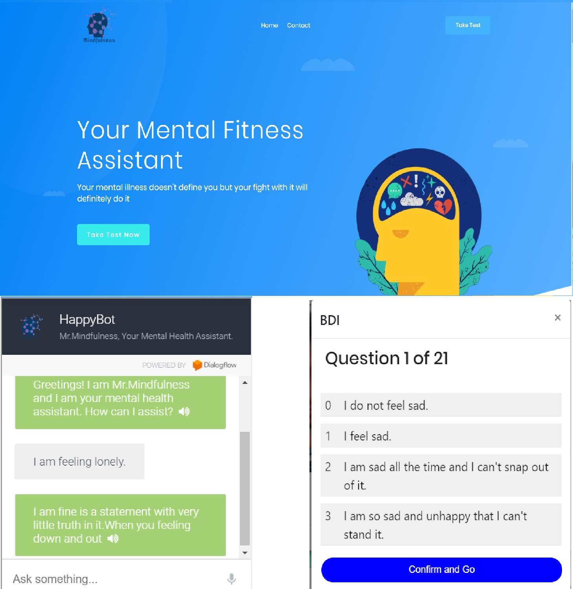

# Mental Fitness Assistant
A web-app that diagnoses any mental illness by understanding your emotions (facial and voice) and various questionnaires and downloadable reports. It also comes with a HappyBot that can talk and lift you up and suggest nearby therapists if needed.

Health is a state of complete physical, mental and social well-being and not merely the absence of disease
or infirmity. We as humans focus just on our physical health. Unfortunately, in most parts of the world,
mental health and mental disorders are not accorded anywhere the same importance as physical health.
Rather, they have been largely ignored or neglected. Mental disorder, if not taken care of, can lead to
1. Disability
2. Permanent memory loss
3. Manipulation or even
4. Self-harm

We explore parameters like tracking anxiety levels, stress levels, and physical and mental tiredness.
CBT is commonly used to treat a wide range of disorders, including phobias, addictions, depression,
and anxiety.
We use CBT(Cognitive behavioral therapy) techniques and methods along with Machine Learning and
Artificial intelligence and provide a feasible solution.

#### EASE OF USE
Simple Elegant and Mobile Compatible Interface.

#### HELPS TO THRIVE
Gives strength when you're down and out.

#### AI CHATBOT ASSISTANCE
A sweet chatbot that can talk and has a slightly dark sense of humor.

#### EMOTIONAL UNDERSTANDING
Understands you from your Face and Voice. Emotion tracking (using facial expression tracking) via web-cam.

#### TESTS
Test applications to check for various mental illnesses like depression, schizophrenia, anxiety, bipolar, etc disorders.

#### RESULTS
Results generated can be downloaded or sent via email.

# Webapp Images

# License

[MIT License Link](https://github.com/amurto/mental-fitness-assistant/blob/master/LICENSE)